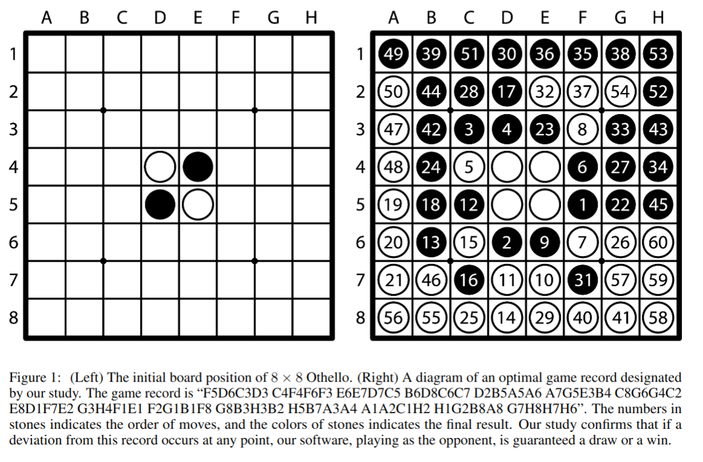

<!-- _class: title -->

# Markdownが救う人類の未来<br>〜御仏は何処にありや〜

## 山田太郎

第1539回 国際Markdownシンポジウム
基調講演

YYYY年MM月DD日

---

<style scoped>
.split-v {
  margin: auto 0;
  justify-content: space-around;
  align-items: center;
}
img {
  object-fit:cover;
	border-radius:50%;
}
</style>

<div class="split-v">
<div>

## 自己紹介

**名前**：stepney141

**所属**：世界Markdown教会 枢機卿

- 紀元前580年生
- 1880年より、Markdown菩薩の現世光臨支援活動に従事

</div>
<div>

<!--  -->


</div>

---

<!--
footer: IMS-1539講演 Markdownが救う人類の未来 by 山田太郎
_class: ochiyai
-->

# 落合フォーマット
### 論文著者名

<code>

## どんなもの？
こんなもの

## 先行研究と比べてどこがすごい？
あそこがすごい

## 技術や手法のキモはどこ？
キモはここ

## どうやって有効だと検証した？
検証法はこれ

## 議論はある？
ある

## 次に読むべき論文は？
あれかな

</code>

<!-- とてもすばらしい原稿がここに入る -->

---

<!-- _class: ochiyai -->

# Othello is Solved
### Hiroki Takizawa (2023)

<code>

## どんなもの？
オセロを弱解決し、最善進行で引き分けになることを示した

## 先行研究と比べてどこがすごい？
史上初めて8x8盤のオセロに理論的な解を与えた

## 技術や手法のキモはどこ？
αβ探索+分割統治法+ドメイン知識の活用で計算量を落とし、スパコンで並列計算した

## どうやって有効だと検証した？
aspiration searchなどの手法を使い、計算しながら解の正しさを保証した

## 議論はある？
必要な計算資源が多すぎる

## 次に読むべき論文は？
未定（強いて言えば、オセロの探索/枝刈り手法をもっと知りたい）

</code>

<!-- とてもすばらしい原稿がここに入る -->

---

<!-- header: "第1章：あいうえお" -->

<style scoped>
.split-v>* {
  width: 100%;
}
.split-v {
  align-items: flex-start;
}
</style>

## あいうえお**あいうえお**あいうえお

あいうえお、<u>あいうえお</u>、あいうえお
あいうえおのような文字のことを **平仮名(ひらがな)** という

<div class="split-v">
<div>

- 左カラム
  - hoge
  - fuga
- 左カラム
  1. foo
  2. bar
- 左カラム
  - foo
  - bar

</div>
<div>

1. 中央カラム
   - hoge
   - fuga
2. 中央カラム
   1. foo
   2. bar
3. 中央カラム
   - foo
   - bar

</div>
<div>

1. 中央カラム
   - hoge
   - fuga
2. 中央カラム
   1. foo
   2. bar
3. 中央カラム
   - foo
   - bar

</div>
<div>

1. 中央カラム
   - hoge
   - fuga
2. 中央カラム
   1. foo
   2. bar
3. 中央カラム
   - foo
   - bar

</div>
<div>

1. 右カラム
   - hoge
   - fuga
2. 右カラム
   1. foo
   2. bar
3. 右カラム
   - foo
   - bar

</div>
</div>


<!-- とてもすばらしい原稿がここに入る -->

---

<!-- header: "第1章：あいうえお > あいうえおとかきくけこの関係" -->

<style scoped>
.split-v>* {
  width: 100%;
}
.split-v {
  align-items: flex-start;
}
</style>

## あいうえお

あいうえおとは

> あいうえお
> <small>(引用：https://example.com)</small>

である。

## かきくけこ

<div class="split-v">
<div>

### かきくけこ

- kakikukeko
- KAKIKUKEKO

</div>
<div>

### カキクケコ

- kakikukeko
- KAKIKUKEKO

</div>
</div>

<!-- とてもすばらしい原稿がここに入る -->

---

<!-- 
header: "第2章：かきくけこ > 素のimg要素をCSSで良い感じに配置"
_class: quote-in-footer
 -->

<style scoped>
.left {
  width: 50%;
}
</style>

## かきくけこ

<div class="split-v">
<div class="left">

〇〇が成り立つ$^{[1]}$

〇〇も成り立つ$^{[2]}$

> [1] https://example.com
> [2] https://one.example.com

</div>
<div>



※右：最善進行での終局図

</div>
</div>

<!-- とてもすばらしい原稿がここに入る -->

---

<!-- 
header: "第2章：かきくけこ > Marpのbg記法で画像を良い感じに配置"
_class: quote-in-footer
 -->

## かきくけこ

〇〇が成り立つ$^{[1]}$

〇〇も成り立つ$^{[2]}$

<div class="tweet">

背景画像として画像を埋め込んでいるので、右半分には文字を出せない

</div>


> [1] https://example.com
> [2] https://one.example.com

<!-- とてもすばらしい原稿がここに入る -->

---

<!-- _header: "第3章：さしすせそ" -->

## さしすせそ

こんな感じでコードブロックを書くことができる。

```python
import torch
print(torch.cuda.is_available())
```

こんな感じでコードブロックを書くことができる。

```python
from transformers import AutoModelForMaskedLM, AutoTokenizer
model = AutoModelForMaskedLM.from_pretrained("cl-tohoku/bert-base-japanese-whole-word-masking")
tokenizer = AutoTokenizer.from_pretrained("cl-tohoku/bert-base-japanese-whole-word-masking")

inputs = tokenizer.encode_plus("私はとても[MASK]です。", return_tensors='pt')
outputs = model(**inputs)
tokenizer.convert_ids_to_tokens(outputs.logits[0][1:-1].argmax(axis=-1))
```

こんな感じでコードブロックを書くことができる。

<!-- とてもすばらしい原稿がここに入る -->

---

<!--
_header: "第4章：たちつてと"
-->

<style scoped>
  .left {
    width: 50%;
    padding-right: 1rem;
  }
  .right {
    width: 50%;
    padding-left: 1rem;
  }
</style>

<div class="split-v">
<div class="left">

  ## たちつてと

  インラインの数式： $ax^2+bx+c$

  $$ I_{xx}=\int\int_Ry^2f(x,y)\cdot{}dydx $$

  $$
  f(x) = \int_{-\infty}^\infty
      \hat f(\xi)\,e^{2 \pi i \xi x}
      \,d\xi
  $$

</div>
<div class="right">

  ## たちつてと

  <video src="./assets/me-at-the-zoo.mp4" controls></video>

</div>
</div>

## たちつてと

<div class="split-v">

<div class="left">
  <div class="tweet">
  なにぬねのなにぬねの

  なにぬねのなにぬねの
  </div>
</div>

<div class="right">
  <div class="tweet">
  なにぬねのなにぬねの
  
  なにぬねのなにぬねの
  </div>
</div>

<!-- とてもすばらしい原稿がここに入る -->

---

<!--
_header: ""
_class: title
 -->

# 終

# 製作・著作<br>(N)(H)(K)
